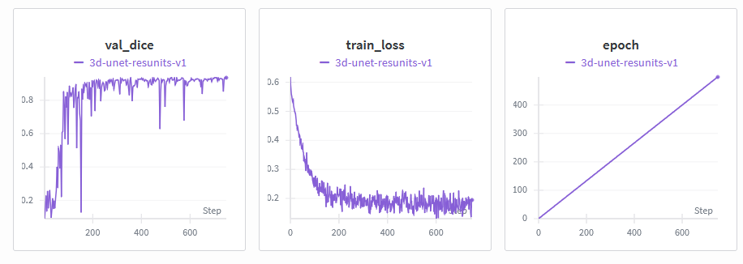

# 3D Spleen Segmentation with MONAI

A robust Deep Learning pipeline designed for clinical-grade spleen segmentation, bridging the gap between PyTorch research and C++ production environments

[](https://www.python.org/downloads/)
[](https://pytorch.org/)
[](https://monai.io/)
[](https://developer.nvidia.com/cuda-toolkit)
[](https://opensource.org/licenses/MIT)

End-to-end 3D semantic segmentation of the spleen from abdominal CT scans using **MONAI** and **PyTorch**. This project implements a training and inference pipeline on the [Medical Segmentation Decathlon](https://medicaldecathlon.com/) Task09 Spleen dataset.

---

## Features

| Component | Description |
|-----------|-------------|
| **Architecture** | 3D UNet with residual units (MONAI) |
| **Loss** | Dice Loss (class-imbalance friendly) |
| **Optimization** | Adam, Automatic Mixed Precision (AMP) |
| **Inference** | Sliding-window 3D prediction |
| **Monitoring** | [Weights & Biases](https://wandb.ai/) (optional) |
| **Post-processing** | Resample predictions to original image geometry |

---

## Results & Performance

### Training metrics (Weights & Biases)

Training and validation curves logged with W&B:



**Final Dice Metric:** `0.93539`
**Inference Time:** < 1s on GPU (RTX 3090).

### Spleen segmentation preview

Animated 3D view of a predicted spleen mask from the test set:


---

## Dataset

- **Source:** [Medical Segmentation Decathlon – Task09 Spleen](https://msd-for-monai.s3-us-west-2.amazonaws.com/Task09_Spleen.tar)
- **Modality:** CT (3D volumes)
- **Labels:** Binary mask (background / spleen)
- **Split:** Training/validation (script split); test set in `imagesTs/`

The download script fetches the dataset from the official MONAI/MSD mirror.

---

## Project Structure

```
medical-ai-spleen-segmentation-MONAI/
├── src/
│   ├── download_data.py   # Download Task09_Spleen
│   ├── explore_data.py   # Visualize samples (slices + save PNG)
│   ├── transforms.py     # Train/val data transforms (spacing, HU, crops)
│   ├── model.py          # 3D UNet (MONAI) definition
│   ├── train_utils.py    # Loss, metrics, optimizer
│   ├── train.py          # Training loop + W&B + checkpointing
│   ├── inference.py      # Sliding-window inference on imagesTs
│   ├── inference.cpp     # C++ ONNX Runtime inference (optional)
│   ├── post_process.py   # Resample prediction to original space
│   └── dataset.py        # Dataset helpers (optional)
├── data/                 # Created by download_data.py
│   └── Task09_Spleen/
│       ├── imagesTr/     # Training images
│       ├── labelsTr/     # Training labels
│       └── imagesTs/     # Test images
├── results/              # Curated results (screenshots, GIFs)
│   └── features/
│       ├── w&b-results.png
│       └── monai-spleen-gif.gif
├── outputs/              # Created at runtime
│   ├── best_model.pth    # Best checkpoint (val Dice)
│   ├── model_spleen.onnx # Exported ONNX model (from export_onnx.py)
│   └── predictions/     # NIfTI segmentations from inference
├── export_onnx.py       # Export PyTorch model to ONNX (Opset 12)
├── validate_onnx.py     # Cross-validate ONNX vs PyTorch outputs
├── requirements.txt
├── check_gpu.py          # PyTorch + MONAI + CUDA check
└── README.md
```

---

## Installation

### 1. Clone and enter the project

```bash
git clone https://github.com/pengularity/medical-ai-spleen-segmentation-MONAI.git
cd medical-ai-spleen-segmentation-MONAI
```

### 2. Create a virtual environment (recommended)

```bash
python -m venv .venv
source .venv/bin/activate   # Linux/macOS
# .venv\Scripts\activate    # Windows
```

### 3. Install dependencies

```bash
pip install -r requirements.txt
```

> **Note:** `requirements.txt` includes PyTorch with CUDA 12.1. For CPU-only or another CUDA version, install PyTorch from [pytorch.org](https://pytorch.org/) first, then `pip install -r requirements.txt`.

### 4. Verify GPU and stack

```bash
python check_gpu.py
```

---

## Usage

All commands below are from the project root. Run training/inference from the project root so that `src` is on `PYTHONPATH`, or use `python -m` as shown.

### 1. Download the dataset

```bash
python src/download_data.py
```

Data is extracted to `data/Task09_Spleen/`.

### 2. Explore the data (optional)

```bash
python src/explore_data.py
```

Writes a sample slice figure to `outputs/sample_exploration.png`.

### 3. Train the model

```bash
python src/train.py
```

- **Outputs:** `outputs/best_model.pth` (best model by validation Dice)  
- **Config:** 500 epochs, batch size 2, sliding-window validation every 2 epochs.  
- **W&B:** If the `WANDB_API_KEY` environment variable is set (or you ran `wandb login`), training metrics are sent to Weights & Biases. Otherwise, W&B runs in **disabled** mode and a warning is printed: *« W&B not configured. Training in local mode only »* — training continues normally without remote logging.  
  To enable W&B: `export WANDB_API_KEY=your_key` (or add it to a `.env` file and load it before running).

### 4. Run inference

```bash
python src/inference.py
```

Reads from `data/Task09_Spleen/imagesTs/`, uses `outputs/best_model.pth`, and writes NIfTI masks to `outputs/predictions/seg_*.nii.gz`.

### 5. Post-process a prediction (optional)

To resample a prediction back to the original image geometry and header (run from the `src` directory or with `PYTHONPATH` including the project root):

```python
from post_process import resample_to_original

resample_to_original(
    "data/Task09_Spleen/imagesTs/spleen_7.nii.gz",
    "outputs/predictions/seg_spleen_7.nii.gz",
    "outputs/predictions/fixed_seg_spleen_7.nii.gz"
)
```

Or run the example in `post_process.py`:

```bash
python src/post_process.py
```

### 6. Export to ONNX (optional)

After training, export the model for use with ONNX Runtime, TensorRT, etc.:

```bash
python export_onnx.py
```

Writes `outputs/model_spleen.onnx` (Opset 12, input/output names `input` / `output`). Requires `outputs/best_model.pth`.

### 7. Validate ONNX vs PyTorch (optional)

Check that the ONNX model matches PyTorch predictions (max difference &lt; 0.01):

```bash
pip install onnxruntime   # or onnxruntime-gpu for CUDA
python validate_onnx.py
```

Requires `outputs/best_model.pth` and `outputs/model_spleen.onnx`.

### 8. C++ inference (optional)

A minimal C++ inference example using the ONNX Runtime C++ API is in `src/inference.cpp`. It expects `outputs/model_spleen.onnx` and an ONNX Runtime SDK (e.g. [onnxruntime-linux-x64-gpu-1.16.3](https://github.com/microsoft/onnxruntime/releases) for GPU, or the CPU package).

**Build** (from project root, adjust paths to your ONNX Runtime install):

```bash
g++ src/inference.cpp -o inference_cpp \
    -I onnxruntime-linux-x64-gpu-1.16.3/include \
    -L onnxruntime-linux-x64-gpu-1.16.3/lib \
    -lonnxruntime -std=c++17
```

**Run** (so the loader finds `libonnxruntime_providers_shared.so` and CUDA libs):

```bash
LD_LIBRARY_PATH=$(pwd)/onnxruntime-linux-x64-gpu-1.16.3/lib ./inference_cpp
```

For CPU-only, use the CPU ONNX Runtime package and remove the CUDA provider from `inference.cpp` (or use the CPU build and do not call `AppendExecutionProvider_CUDA`).

---

## Deployment & Optimization (Bonus)

To bridge the gap between research and production, this project includes a complete C++ inference pipeline.

* **ONNX Export:** The PyTorch model is exported to ONNX (Opset 12) for interoperability (`export_onnx.py`).
* **Numerical Validation:** A cross-validation script (`validate_onnx.py`) ensures the exported model maintains a max difference &lt; 0.01 compared to PyTorch predictions.
* **C++ Inference:** A low-latency inference prototype using **ONNX Runtime C++ API** is provided in `src/inference.cpp` (see Usage step 8 for build and run).

---

## Configuration Summary

| Item | Value |
|------|--------|
| Input size (train) | 96×96×96 (random crop) |
| Spacing | (1.5, 1.5, 2.0) mm |
| HU window | [-57, 164] (soft tissue) |
| Sliding window | 96×96×96, overlap 4 |
| Optimizer | Adam, lr=1e-4 |
| Checkpoint | Best validation Dice |

---

## License

This project is licensed under the **MIT License** – see the [LICENSE](LICENSE) file for details.

---

## Acknowledgments

- [MONAI](https://monai.io/) for medical imaging utilities and 3D UNet
- [Medical Segmentation Decathlon](https://medicaldecathlon.com/) for the Task09 Spleen dataset
- [MONAI Spleen Segmentation Tutorial](https://github.com/Project-MONAI/tutorials/blob/main/3d_segmentation/spleen_segmentation_3d.ipynb) for the tutorial inspiration
- [Weights & Biases](https://wandb.ai/) for experiment tracking
- [ONNX Runtime](https://onnxruntime.ai/) for the C++ inference pipeline and ONNX validation
